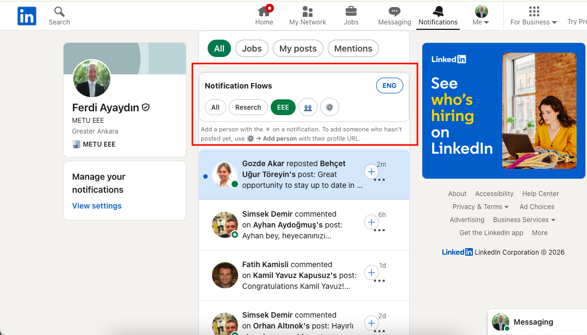
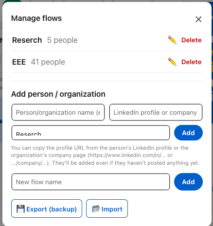
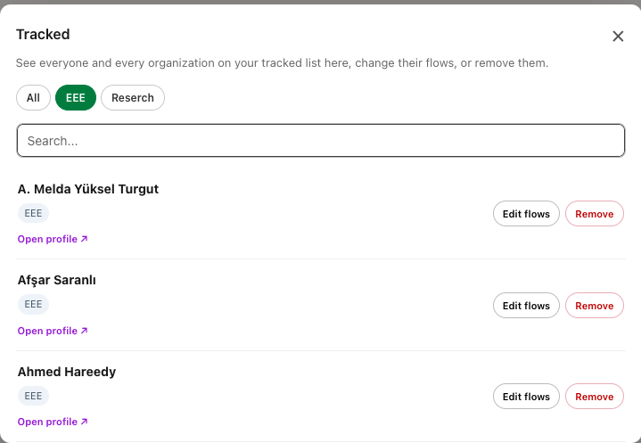

# LinkedIn Flow Filter — v0.2.1

This **Chrome extension** splits LinkedIn's 
Notifications page into custom flows (tabs) by person or organization. Create 
your own groups — e.g. "Close Contacts", "Companies" — and see only 
their notifications.

**Language:** The panel's own interface is available in **both English and
Turkish**. It opens in English by default; use the **TR/ENG** button in the
header to switch anytime — your choice is saved.

**Privacy & Security Notice:** All settings are stored only in your own browser
(`chrome.storage.local`) and never sent anywhere. `content.js` makes no
network requests (`fetch`/`XHR`) to any server at all.

This extension is installed via Chrome's **"Load unpacked"** (developer
mode), not the Chrome Web Store — meaning it does **not** go through
Google's code review. Because of that:

- **Only download from this repository** (the actual GitHub URL above).
  Don't trust a "copy" of this extension shared somewhere else — the code
  may have been modified.

- The code is fully open and readable (`content.js`, a single file, not
  minified) for anyone who wants to review it before installing.

**Note:** This is not an official extension published or endorsed by
LinkedIn; it's an independent personal tool. If LinkedIn changes its page
structure, the extension may temporarily stop working correctly.

## Screenshots

**English**

 
 

## Installation
1. Download this repository as a ZIP (green **Code → Download ZIP** button) and unzip it.
2. Type `chrome://extensions` in Chrome's address bar.
3. Turn on **Developer mode** (top right).
4. Click **Load unpacked**, select the unzipped folder.
5. Refresh the LinkedIn Notifications page (linkedin.com/notifications).

(Works the same way on other Chromium-based browsers — Edge, Brave, Opera.)

## Basic usage
- Click the **＋** button that appears on a notification card to add that
  person/organization to one or more flows.
- Use the tabs at the top to pick a flow and see only that flow's
  notifications.
- **⚙ (Manage Flows)** manages flows: create new flows, delete them, add or
  remove people/organizations, back up your data.
- **👥 (People)** lists everyone you're tracking in one screen; filter by
  flow using the buttons at the top, search by name, edit someone's flows,
  or remove them from all flows.

## Adding someone who hasn't posted anything yet
Two ways:
1. **⚙ → Add person/organization** — enter a name and their LinkedIn
   profile (`/in/...`) or company page (`/company/...`) URL, pick a flow,
   add.
2. Visit that person's profile or the organization's company page — a
   **＋ Add to Notification Flow** button appears in the bottom right.

Note: if LinkedIn hasn't generated any notification about that person/org
yet, there's no card to filter — once one appears in the future, it will
automatically show up in the right flow.

## Backup (Export/Import)
Extension data is tied to your browser profile, so it can be lost (profile
switches, signing out of Chrome, reloading from a different folder, etc.).
Use **⚙ → 💾 Export** to download all your flows/people as a JSON file, and
**📂 Import** to load it back into the same or another browser. We recommend
taking a backup after any significant changes.

## Technical note
The extension locates notification cards using the
`article.nt-card[data-view-name="notification-card-container"]` selector.
If LinkedIn changes this structure, the extension may stop recognizing
cards — in that case the selector needs to be updated (see Issues).
